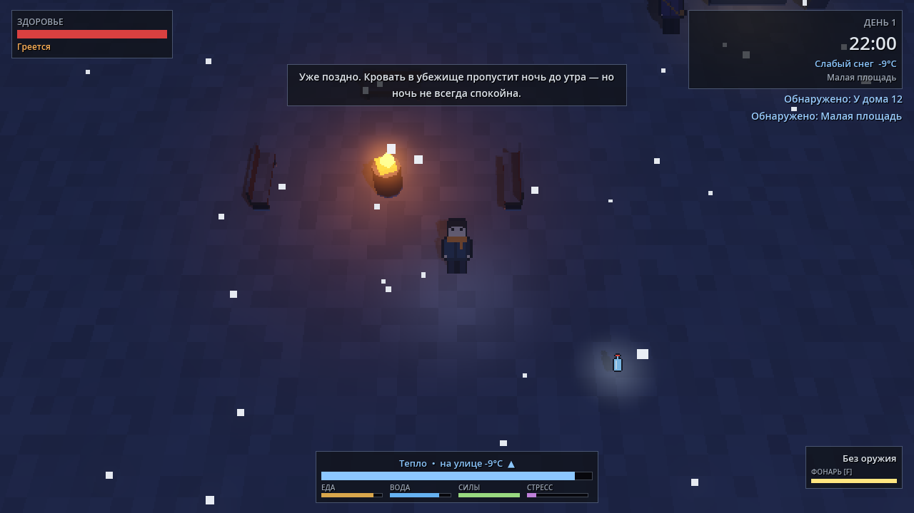
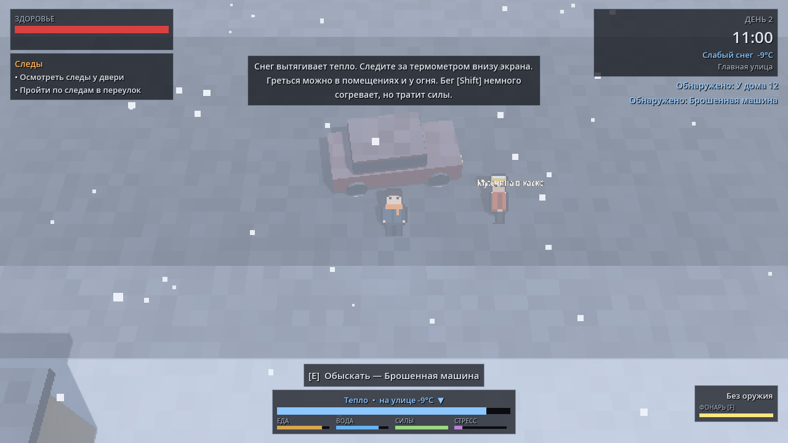
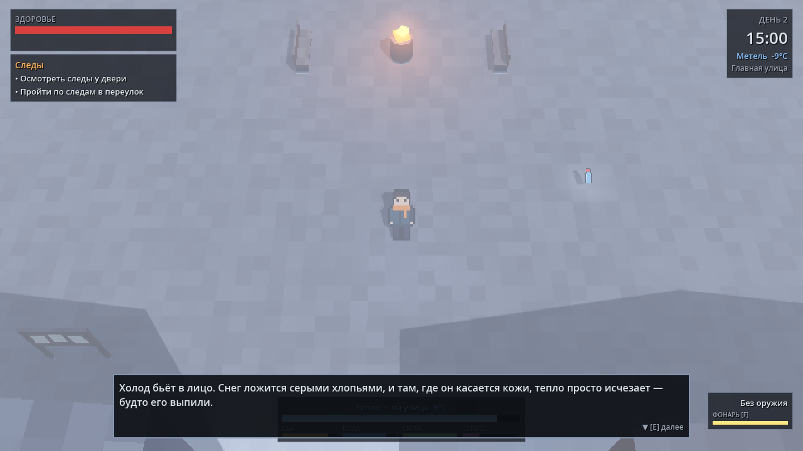
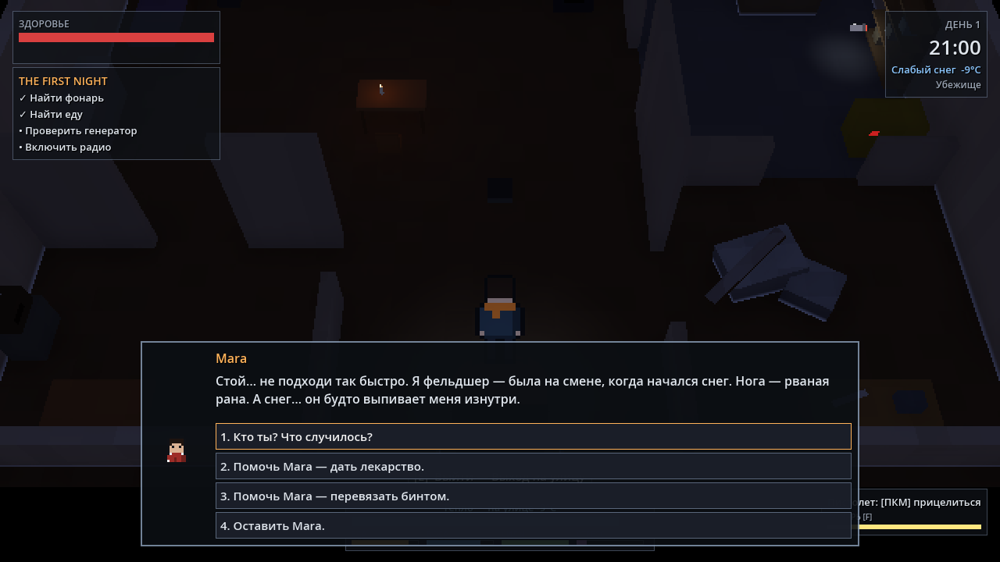
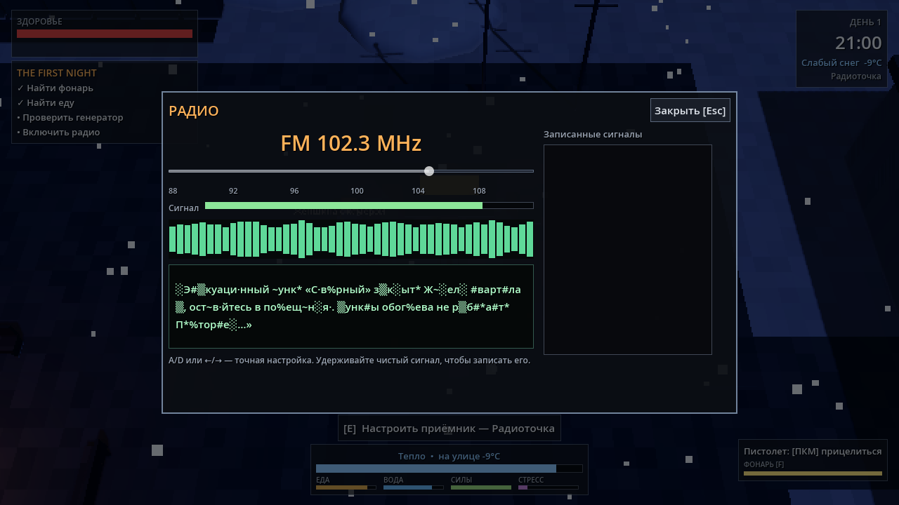
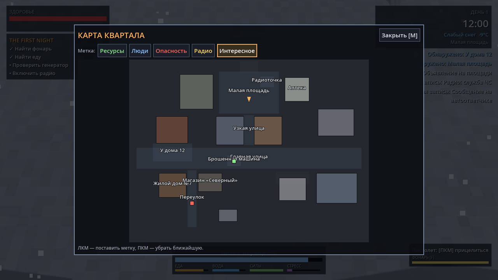

# LAST SNOW — вертикальный срез (Godot 4)

Сюжетная survival-adventure: пиксельные персонажи внутри объёмного low-poly города, засыпанного смертельным снегом. Это первый играбельный прототип: маленький, но законченный кусок игры с циклом «убежище → вылазка → решения → возвращение → ночь → новый день → финал».

| Ночь на площади | День, брошенная машина | Метель |
|---|---|---|
|  |  |  |

| Диалог и моральный выбор | Радио (мини-игра) | Карта с метками |
|---|---|---|
|  |  |  |

---

## 1. Требования и запуск

- **Godot 4.7** (проверено на 4.7.2 stable). Совместимость с **4.4.1** проверена отдельным прогоном всех тестов.
- Рендерер **Forward+** (Vulkan). На машинах без Vulkan Godot автоматически переходит на Compatibility (`rendering_device/fallback_to_opengl3=true`); игра работает в обоих режимах.
- Внешних зависимостей, плагинов и ассетов нет: весь арт и звук генерируются процедурно.

**Запуск:**
1. Откройте папку проекта в Godot (Project Manager → Import → `project.godot`). При первом открытии редактор проиндексирует скрипты (несколько секунд).
2. Нажмите **Play Project (F5)**. Главная сцена — `res://scenes/main/Main.tscn`, ручная настройка не нужна.
3. В меню: **Новая игра** — новое прохождение; **Продолжить** — последнее сохранение.

**Как начать новый save:** «Новая игра» сбрасывает все системы. Сохранить игру — `Esc → Сохранить → Слот 1/2/3`; автосохранение идёт в отдельный слот `auto`. Файлы лежат в `user://saves/slot_<n>.json` (Windows: `%APPDATA%/Godot/app_userdata/Last Snow/saves`).

## 2. Управление

| Клавиша | Действие |
|---|---|
| WASD / стрелки | Движение (относительно камеры) |
| Shift | Бег (тратит выносливость, немного согревает, шумно) |
| Ctrl | Тихий шаг (стелс) |
| E | Взаимодействие / далее в диалоге |
| 1–9 | Выбор реплики |
| I (или Tab) | Рюкзак |
| M | Карта (ЛКМ — поставить метку, ПКМ — убрать) |
| Q | Журнал: задания, записи, люди |
| F | Фонарь |
| ПКМ (удерж.) + ЛКМ | Прицел + выстрел |
| R | Перезарядка |
| H | Быстрое лечение (бинт при кровотечении/ранении, лекарство при болезни) |
| Esc | Меню / закрыть панель |
| **F1** | **Debug-меню** (только в debug-сборке) |

Клавиши привязаны к физическим кодам, поэтому WASD работает и на русской раскладке. Переназначение предусмотрено архитектурно: `InputBindings` + `Settings`, хранится в `user://settings.cfg`.

**Debug (F1):** Give Items, Add Food, Add Ammo, Heal, Set Temperature, Set Time, Set Day, Trigger Blizzard / Heavy Snow / Clear Weather, Teleport, Complete Quest, Set Story Flag, Spawn NPC here, Spawn Enemy, Shelter +1, Sleep, Ending check, Quick Save, God mode, **Debug overlay** (день, время, температура, голод, вода, погода, уровень снега, убежище, живые NPC, текущий квест, флаги).

## 3. Что можно сделать за 15–25 минут

1. **Интро.** Квартира, ветер, звонит телефон: на автоответчике сосед Elias. Посмотрите в окно — пойдёт серый снег, погаснет свет, появится `DAY 1 — 19:32`.
2. **THE FIRST NIGHT.** Найти фонарь, еду, проверить генератор, включить радио: «…не выходите после усиления снега…» → QUEST UPDATED.
3. **Выход наружу.** Tutorial по холоду. Термометр внизу экрана падает, у бочки с огнём на площади можно согреться.
4. **Mara.** Раненый фельдшер на узкой улице. Дать лекарство, перевязать бинтом или уйти. Последствия проявятся позже: она будет в убежище, в аптеке или погибнет после метели, и её сумку можно будет найти.
5. **Радиоточка на площади.** Мини-игра с ползунком частоты: шум стихает, текст проступает из помех, сигнал записывается в журнал.
6. **Первая метель** на обратном пути: видимость падает, снег бьёт в «объектив», дыхание учащается. Из белой мглы на несколько секунд выходит **Snow Stalker**. Можно спрятаться за баком, убежать или выстрелить — убивать не обязательно.
7. **Убежище.** Склад, мастерская (крафт), улучшение до мастерской, ремкомплект, генератор, сон.
8. **Ночь → событие** (стук в дверь, болезнь, шорохи, разговор с Mara) → **день 2**: следы у двери, незнакомец в сером, Elias, Tomas, Vera, Anton.
9. **День 3 — большая метель.** Утро 4-го дня приносит финал.

**Финалы** (условия скрыты от игрока, это не хорошо/плохо):
- **SIGNAL** — выйти в эфир с радиостанции убежища;
- **DEPARTURE** — уйти по северной дороге;
- **HOME** — убежище выстояло;
- **THE LONG WINTER** — если ни одно из состояний не сложилось.

Эпилог перечисляет последствия решений.

## 4. Структура проекта

```
project.godot            настройки, autoload, слои физики, global shader var snow_amount
autoload/                глобальные сервисы (см. §5)
scenes/
  main/Main.tscn         точка входа: SubViewport-мир + UI + системы
  world/District.tscn    Квартал 9 (улица, площадь, аптека, магазин, дом №7, переулок, подстанция, северная дорога)
  shelter/Shelter.tscn   убежище: main room / storage / workshop / radio room
  player/                Player.tscn, CameraRig.tscn
  npc/NPC.tscn  enemies/SnowStalker.tscn  ui/UI.tscn
scripts/
  core/        main, level, conditions, consequences, world_state, information_data,
               input_bindings, ending_director, tutorial_director
  player/      player, camera_rig, camera_settings, interaction_sensor, flashlight, combat, footprints, breath
  interaction/ interactable + level_door, loot_container, item_pickup, info_pickup, examine, phone,
               bed, station (crafting/storage/shelter/radio), generator, stove, hiding_spot
  inventory/   item_data, inventory, storage_system
  crafting/    recipe_data, crafting_system
  survival/    player_stats, survival_system, indoor_zone, heat_zone
  npc/         character_data, npc, npc_talk, npc_registry, relationship_system
  combat/      weapon_data, snow_stalker (FSM), enemy_spawner, stealth
  weather/     weather_preset, weather_visuals (снег), lighting_controller (день/ночь)
  world/       lowpoly_block, lowpoly_prop, mesh_builder, location_zone, district
  shelter/     shelter_system (апгрейды), shelter_controller
  gfx/         pixel_art (процедурные спрайты/иконки), pixel_character (анимация билборда)
  audio/       procedural_audio (синтез звуков), ambience_controller
  ui/          ui_root, ui_kit (тема), hud, screen_effects, ui_panel + panels/*
data/
  items/*.tres recipes/*.tres characters/*.tres information/*.tres weather/*.tres config/camera_settings.tres
  dialogues/*.json quests/*.json events/*.json radio/signals.json
  world/days.json world/shelter_upgrades.json world/endings.json
shaders/       lowpoly_snow.gdshader (снег по нормалям + dither-затухание), screen_effects.gdshader
tests/         test_runner + unit/*, acceptance/AcceptanceTest.tscn
tools/         CheckScripts.tscn (загрузка всех скриптов/сцен), Screenshot.tscn (рендер сцен в PNG)
docs/          скриншоты (.gdignore — Godot их не импортирует)
assets/        место для настоящих ассетов (audio/<id>.ogg подхватывается автоматически)
```

Отличие от предложенной структуры: добавлены `scripts/interaction`, `scripts/world`, `scripts/gfx`, `scripts/ui/panels` и `data/world`. Взаимодействие, мир и процедурная графика — самостоятельные слои, и их удобнее держать отдельно от player/npc.

## 5. Архитектура

### Поток кадра

```
Main (Node, PROCESS_ALWAYS)
 ├─ WorldView: SubViewportContainer (stretch_shrink = пикселизация, nearest)
 │   └─ SubViewport → World: LevelContainer (District | Shelter), Player, CameraRig, WeatherVisuals
 ├─ ScreenEffects (CanvasLayer): иней, пульс здоровья, стресс, снег на «объективе», вспышки
 ├─ UI (CanvasLayer): HUD + модальные панели (открытая панель ставит мир на паузу)
 └─ Systems: AmbienceController, TutorialDirector
```

3D-мир рендерится в пониженном разрешении с nearest-фильтром, поэтому пиксельные спрайты и low-poly геометрия получаются в одном стиле, а UI остаётся чётким. Степень пикселизации настраивается («Пикселизация 3D»).

### Autoload — только глобальные сервисы

| Autoload | Зачем глобальный |
|---|---|
| `Data` | реестр всего контента (читается отовсюду, неизменяемый) |
| `Settings` | громкость по шинам, скорость текста, тряска, яркость, UI scale, раскладка |
| `AudioManager` | шины Music/Ambient/SFX/Dialogue/Radio, пулы плееров, процедурные звуки |
| `GameState` | фасад состояния прохождения (см. ниже) |
| `TimeManager` | игровые часы; день 07:00–24:00, ночь 00:00–07:00, номер дня меняется в 07:00 |
| `WeatherManager` | LIGHT/HEAVY/BLIZZARD, плавные переходы, расписание дней, форс-погода событий |
| `QuestManager` | прогресс квестов, самопроверяющиеся цели |
| `DialogueManager` | исполнение графов диалогов |
| `EventManager` | случайные, ночные, утренние, отложенные и сюжетные события |
| `RadioManager` | частоты, «чистота» сигнала, запись сигналов |
| `SaveManager` | слоты 1/2/3 + auto, миграции |

Всё остальное — сцены и компоненты: `SurvivalSystem` — дочерний узел игрока, `Inventory`, `RelationshipSystem`, `NPCRegistry`, `WorldState`, `PlayerStats` — обычные `RefCounted`-объекты внутри `GameState`. Монолитного GameManager нет: `GameState` только хранит данные, а логика живёт в маленьких системах.

### Единый язык данных: Conditions и Consequences

Диалоги, квесты, события, радиосигналы, интерактивные объекты, рецепты, апгрейды и финалы описывают требования и эффекты одинаковыми словарями. Каждая система регистрирует свои ключи в `_ready` (`Conditions.register(...)`), поэтому ядро ни от кого не зависит, а новые ключи добавляются без правки старого кода.

```json
{"if": {"flag": "radio_found"}, "give_item": ["cloth", 2]}
[{"item": ["medicine", 1]}, {"tier_min": ["mara", "cooperative"]}, {"any": [{"weather": "BLIZZARD"}, {"is_dark": true}]}]
```

<details><summary>Все ключи</summary>

**Conditions:** `flag`, `not_flag`, `item`, `no_item`, `any_item`, `storage_item`, `item_total`, `food_total_min`, `equipped`, `info`, `not_info`, `info_count_min`, `discovered`, `location`, `shelter_level(_min)`, `npc_alive`, `npc_dead`, `npc_at`, `npc_not_at`, `npc_met`, `npc_injured`, `relationship {npc, stat, min, max}`, `tier_min`, `tier_max`, `memory [npc, key, value]`, `decision`, `survivors_min`, `stat_below`, `stat_above`, `world`, `world_min`, `route_open`, `day`, `day_min`, `day_max`, `hour_between`, `is_night`, `is_dark`, `weather`, `not_weather`, `severe_weather`, `quest_active`, `quest_completed`, `quest_not_started`, `quest_stage`, `objective_done`, `event_fired`, `radio_found`, `radio_count_min`, `dialogue_seen`, `any`, `all`, `not`, `chance`, `always`. В NPC-контексте `"self"` = текущий собеседник.

**Consequences:** `set_flag`, `clear_flag`, `give_item`, `take_item`, `give_storage`, `take_storage`, `relationship`, `memory`, `add_info`, `discover_location`, `npc_location`, `npc_value`, `npc_met`, `npc_stat`, `kill_npc`, `stat`, `status` (bleeding/illness/warm_pack), `decision`, `notify`, `hint`, `title_card`, `shake`, `flash`, `sound`, `shelter_level`, `world`, `route`, `faction`, `world_request`, `ending`, `evaluate_ending`, `feed_survivors`, `start_quest`, `complete_quest`, `fail_quest`, `complete_objective`, `track_quest`, `schedule_event [id, минуты]`, `trigger_event`, `cancel_event`, `start_dialogue`, `show_text`, `weather [state, минуты, переход]`, `clear_forced_weather`, `advance_time`, `start_time`, `radio_lock`. Любой словарь может иметь guard `"if"`.
</details>

Нет очков «добра/зла»: решения записываются как конкретные факты (`decision mara_help = "bandage"`, `memory mara.player_refused_help`). Последствия бывают:
- немедленные — реплика, отношения;
- отложенные — `schedule_event`: например, смерть Mara после метели;
- долгосрочные — флаги, которые читают финалы и эпилог.

### Сигналы (основные)

`TimeManager`: `minute_passed`, `hour_passed`, `day_changed`, `morning_started`, `evening_started`, `night_started` · `WeatherManager`: `weather_changed`, `weather_updated` · `QuestManager`: `quest_started`, `quest_updated`, `objective_completed`, `quest_completed` · `Inventory`: `item_added`, `item_removed`, `equipment_changed` · `NPCRegistry`: `npc_died`, `npc_moved` · `RelationshipSystem`: `relationship_changed`, `tier_changed` · `GameState`: `story_flag_changed`, `decision_made`, `information_discovered`, `location_discovered`, `location_changed`, `shelter_upgraded`, `ending_requested`, `world_request`, `presentation_requested` · `RadioManager`: `radio_signal_found` · `DialogueManager`: `dialogue_started`, `line_shown`, `dialogue_ended`.

В начале каждого системного скрипта есть шапка «Purpose / Dependencies / Public API / Signals / Save Data».

### Ключевые механики

- **Холод** (`SurvivalSystem`). Потеря тепла зависит от погоды (`cold_rate`), ветра, темноты, утепления одежды, грелки, бега и болезни. В помещении тепло восстанавливается (без отопления — до ~65), у огня — быстро. Критические состояния отнимают здоровье медленно: в метели без куртки есть около 3–4 минут.
- **Снег** накапливается по дням (`days.json → snow_level`) через глобальную шейдерную переменную `snow_amount`: белеют крыши и машины, у стен растут сугробы. Маршруты (`WorldState.routes`) — точка расширения для навигации.
- **Стелс.** У игрока есть `noise_level`: тихий шаг < ходьба < бег < выстрел. Метель глушит звуки. Видимость падает без фонаря, в темноте, в метели и в укрытии.
- **Snow Stalker** — FSM `IDLE → PATROL → INVESTIGATE → CHASE → ATTACK → SEARCH → RETURN`, плюс `RETREAT` и `APPARITION`. Навигация — NavMesh, запекается при загрузке квартала.
- **Следы** — один MultiMesh на 180 отпечатков, в метель исчезают в 5 раз быстрее; позиции доступны врагам (`get_recent_positions`).
- **Камера.** Мягкое следование, отдаление на улице и при беге, ограничение картой, SpringArm. Здания между камерой и игроком растворяются dither-эффектом целиком: тело, крыша и окна объединены в fade-группу. Все параметры лежат в `data/config/camera_settings.tres`.
- **Производительность.**
  - Каждый проп и блок — один меш с вершинными цветами (`MeshBuilder`), одинаковые меши кэшируются.
  - Один общий материал на весь мир и ноль per-instance uniform'ов.
  - Выживание тикает раз в 0,2 с, погода — раз в 0,25 с, окклюзия — раз в 0,12 с; частицы снега — один GPUParticles-бокс вокруг игрока.

## 6. Как добавлять контент

**Предмет.** Скопируйте `data/items/canned_food.tres`, поменяйте `id` и поля. Иконка: заполните `icon` текстурой или оставьте `icon_shape`/`icon_color` для процедурной. Эффект использования — массив Consequences в `use_effects`, например `[{"stat": {"hunger": 30}}]`. Экипировка задаётся через `equip_slot` (`body`/`face`/`hand`) и `insulation`. Оружие — `WeaponData` (`data/items/pistol.tres`). Предмет сразу доступен везде: лут, рецепты, диалоги, debug.

**Рецепт.** `data/recipes/*.tres`: `ingredients {id: count}`, `result_item`, `crafting_time` (игровые минуты), `required_shelter_level`, `conditions`.

**NPC.**
1. Создайте `data/characters/<id>.tres` (`CharacterData`): имя, возраст, профессия, био, фраза, потребность, навыки, палитра, `silhouette`, `accessory`, `dialogue_id`, `start_location` + `start_spawn`.
2. В нужном уровне добавьте `Marker3D` с именем `npc_<start_spawn>` в узел `Spawns`. Уровень сам заспавнит NPC и будет обновлять его при смене локации или смерти.
3. Спрайт генерируется из палитры. Настоящий лист (4×5 кадров 24×28) кладите в `sprite_sheet`.

**Диалог.** `data/dialogues/<id>.json`: `{"id", "start", "nodes": {...}}`. Типы узлов:
- текстовый: `speaker`, `text`, `choices` или `next`;
- `branch`: `[{"if": …, "next": …}]`;
- action-узел: `consequences` + `next`.

У выбора бывают `if` (скрыт, если условие ложно), `requires` + `requires_text` (показан неактивным), `consequences`, `next`, `once`. Подстановки в тексте: `{player}`, `{npc}`.

**Квест.** `data/quests/<id>.json`: `stages[].objectives[]` с полем `condition` — цель выполняется сама, когда условие становится истинным, и остаётся выполненной. Дополнительно: `optional`, `hidden`, `on_complete`, `rewards`, `consequences`, `completion_flags`, `auto_start`.

**Событие.** `data/events/*.json` → `trigger`:
- `hourly` / `night` / `morning` / `time` (`at {day, hour, minute}`) / `scheduled` / `enter` / `manual`;
- фильтры и частота: `conditions`, `chance`, `weight`, `once`, `cooldown_hours`, `location`, `wait_for_location`;
- что происходит: `consequences`, `notify`, `dialogue`.

**Радиосигнал.** `data/radio/signals.json`: `frequency`, `stations` (`shelter_basic`/`radio_point`/`shelter_station`), `conditions`, `text`, `info`, `consequences`, `voice_pitch`.

**Локация.** Сцена с корнем-`Level` (`level_id`, `bounds`, `is_interior`, `heated_conditions`), узлами `Spawns/spawn_<id>` и `Actors`, плюс строка в `Main.LEVELS`. Переход между уровнями — узел `LevelDoor` с полями `target_level`/`target_spawn`. Блоки (`LowPolyBlock`) и пропы (`LowPolyProp`, 38 видов) — `@tool`-узлы, их удобно двигать прямо в редакторе.

**Звук.** Положите `assets/audio/<id>.ogg`, например `wind.ogg` или `gunshot.ogg`. `AudioManager` возьмёт файл вместо процедурного синтеза.

## 7. Тесты и инструменты разработчика

```bash
godot --headless --path . --editor --quit                          # первый импорт (кэш классов)
godot --headless --path . res://tests/TestRunner.tscn              # 39 модульных тестов, код выхода = число провалов
godot --headless --path . res://tests/acceptance/AcceptanceTest.tscn   # приёмочный тест: 67 шагов через Main.tscn
godot --headless --path . res://tools/CheckScripts.tscn            # загрузить каждый .gd/.tscn/.tres
xvfb-run godot --path . res://tools/Screenshot.tscn                # рендер сцены в PNG (env SHOT_*)
```

- **Модульные тесты:**
  - inventory: add/remove/consume/equip/вес/сериализация;
  - storage и crafting: валидация материалов, уровень мастерской;
  - апгрейды убежища;
  - survival: холод снаружи, метель, куртка, отопление, медленный урон;
  - relationships: тиры, memory-флаги;
  - диалоги: выбор Mara меняет мир, неактивные варианты;
  - квесты: завершение, «защёлкивание» целей;
  - радио, погода, отложенные последствия;
  - все 4 финала с проверкой скрытых условий;
  - стелс и FSM сталкера;
  - save/load, включая старые и битые сейвы.
- **Проверка целостности данных:** каждый `next` в диалогах существует; каждый ключ условий и последствий зарегистрирован; все id предметов, NPC, квестов, событий, записей и диалогов, упомянутые в данных и на уровнях, существуют. Есть самопроверка валидатора.
- **Приёмочный тест** проходит пункты 1–28 из §70 ТЗ на реальной `Main.tscn`.

## 8. Отчёт по фазам

| Фаза | Что создано | Проверено |
|---|---|---|
| 1 Setup | `project.godot`, слои, `Data`, `Settings`/`InputBindings`, `Conditions`/`Consequences`, `GameState` (+Inventory, PlayerStats, Relationships, NPCRegistry, WorldState), `TimeManager`, тест-раннер | 6 тестов ядра |
| 2 Player+Camera | движение с ускорением/торможением, бег/тихий шаг, `CameraRig` + `CameraSettings`, пиксельные спрайты | скриншоты, приёмочный |
| 3 World | генерация District/Shelter, `LowPolyBlock`/`LowPolyProp`, снег в шейдере, освещение день/ночь, небосвод-«скайлайн» | скриншоты Forward+ и Compatibility |
| 4 Interaction | `Interactable` + 12 наследников, сенсор, персистентные состояния объектов | валидатор данных, приёмочный |
| 5 Inventory | 17 предметов, рюкзак, склад, вес, экипировка | модульные |
| 6 Survival | холод/голод/жажда/силы/стресс/кровотечение/болезнь, HUD, экранные эффекты, туториалы | модульные |
| 7 NPC | Mara, Elias, Tomas, Vera, Anton + Sorel (Unknown), отношения, память | модульные, приёмочный |
| 8 Dialogue | data-driven графы, неактивные варианты, портреты, typewriter | модульные |
| 9 Quest | THE FIRST NIGHT, Тепло, Лекарства, Сигнал, Следы, Незнакомец, Последний снег | модульные |
| 10 Crafting | 5 рецептов, мастерская, апгрейды 1→2→3 | модульные |
| 11 Weather | 3 пресета, расписание 4 дней, форс-метель, частицы, туман, линза, звук ветра | модульные, скриншоты |
| 12 Combat | пистолет (урон/дальность/темп/магазин/шум/износ), Snow Stalker FSM, стелс, укрытия | модульные, приёмочный |
| 13 Radio | 6 сигналов, мини-игра, Information, фракция Unknown | модульные |
| 14 Save | 3 слота + auto, миграции, автосейв утром/в убежище/после квестов и решений | модульные, приёмочный |
| 15 Ending | SIGNAL / DEPARTURE / HOME / THE LONG WINTER + эпилог | модульные, приёмочный |
| 16 QA | валидатор данных, приёмочный тест, проверка в 4.4.1, чистка утечек | всё зелёное |

### Найденные и исправленные ошибки (выборка)

| ERROR | Cause | Fix | Verification |
|---|---|---|---|
| `Invalid operands 'bool' and 'int'` | флаги разных типов из JSON | `Conditions.values_equal/truthy` | test_core |
| double free при выходе | лямбды автолоадов в статических словарях | `clear_handlers()` в `Data._exit_tree` | чистый выход |
| Too many instances using shader instance variables | >2000 мешей с instance-uniform | слияние пропов в один меш + 5 материалов-ступеней затухания | скриншоты без ошибок |
| игрок проваливался под землю | в сгенерированных .tscn `script` стоял после свойств | `script` первым полем узла | raycast-проба, приёмочный |
| HUD/панели нулевого размера | `set_anchors_preset` в `_ready` сохраняет старый rect | `set_anchors_and_offsets_preset` | скриншоты UI |
| камера «в крыше» | камера ниже коньков крыш, скаты без коллизии | камера выше, слой `occluder`, fade-группы зданий | скриншот метели |
| квест «Сигнал» не завершался дома | смена локации не будила QuestManager | сигнал `location_changed` | приёмочный |
| `scaled_local` отсутствует в 4.4 | новый API | `Basis * Basis.from_scale()` | тесты на 4.4.1 |
| утечки AudioStreamPlayback в headless | нет потока микшера у dummy-драйвера | в headless звук синтезируется, но не воспроизводится | тесты без предупреждений |

## 9. Финальный чеклист

| | | | |
|---|---|---|---|
| ✅ Project opens | ✅ Main scene works | ✅ Player moves | ✅ Camera works |
| ✅ Interaction works | ✅ Inventory works | ✅ Items work | ✅ Survival works |
| ✅ Cold works | ✅ Weather works | ✅ Day/night works | ✅ NPC works |
| ✅ Dialogue works | ✅ Choices work | ✅ Relationship changes work | ✅ Quest works |
| ✅ Crafting works | ✅ Shelter works | ✅ Storage works | ✅ Radio works |
| ✅ Information works | ✅ Enemy works | ✅ Combat works | ✅ Stealth works |
| ✅ Save works | ✅ Load works | ✅ Debug menu works | ✅ Prototype ending works |
| ✅ No critical console errors | ✅ README exists | | |

Чеклист закрыт автотестами и headless-прогонами. Проверить не удалось только «живое» управление с клавиатуры и мыши (включая прицел мышью в SubViewport) и реальный FPS на видеокарте: среда разработки без дисплея, рендер шёл на программном lavapipe/llvmpipe.

## 10. Решения и интерпретации ТЗ

- **Размер карты.** Квартал ~160×120 м с интерьерами: полный круг по всем точкам интереса — около 5–10 минут. Пешком от края до края по прямой — около минуты: карта намеренно маленькая, это вертикальный срез.
- **Первая метель** — короткий скриптовый шквал в первую ночь: витрина атмосферы (§73, §79). Полноценная метель наступает на 3-й день по расписанию (§20).
- **Язык.** Весь игровой текст на русском; заголовки, заданные в ТЗ по-английски, оставлены как есть: `THE FIRST NIGHT`, `QUEST UPDATED`, `THE NIGHT CONTINUES`, `ENDING: HOME`. Код и комментарии на английском.
- **Фракции.** В MVP есть `survivors` и `unknown`: символ, следы, тёплый цилиндр, сигнал «Числа», NPC Sorel, закрытая подстанция. Emergency и Armed Group — точки расширения в `WorldState.faction_attitude`.
- **Арт и звук** — процедурные заглушки. Персонажи различаются палитрой, силуэтом (5 типов) и аксессуаром (8 типов). Всё заменяется подстановкой ресурса без изменения кода.

## 11. Что дальше

- Настоящие спрайт-листы и звуки: форматы и точки подстановки уже готовы.
- Второй район и открытие маршрутов через `WorldState.routes`; расписания NPC; расход топлива генератора.
- Локализация: строки уже в данных, следующий шаг — `tr()` + CSV.
- Геймпад: `InputBindings` расширяется записями `joy:`.
- Экран переназначения клавиш: API есть (`InputBindings.rebind`), нужен UI.
